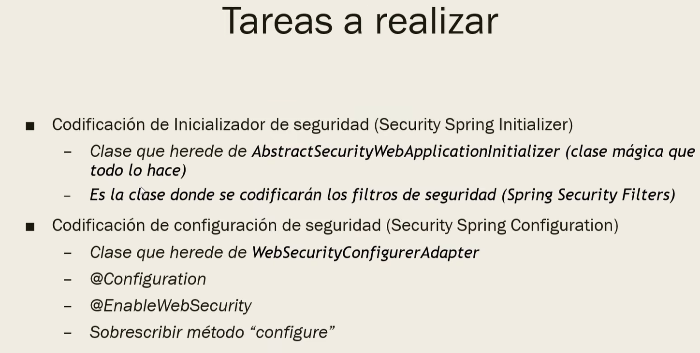
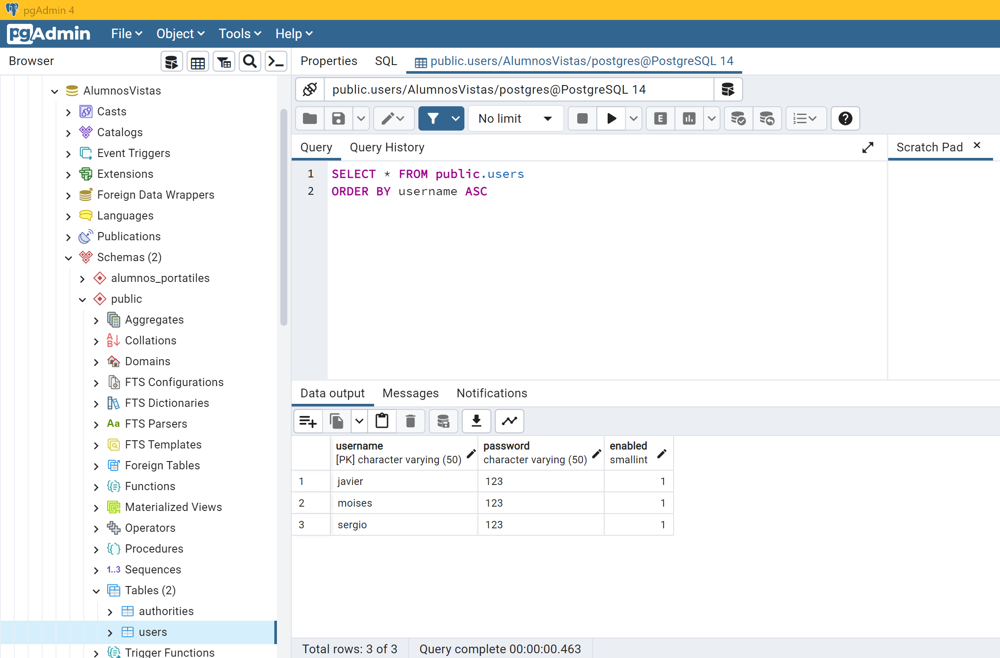
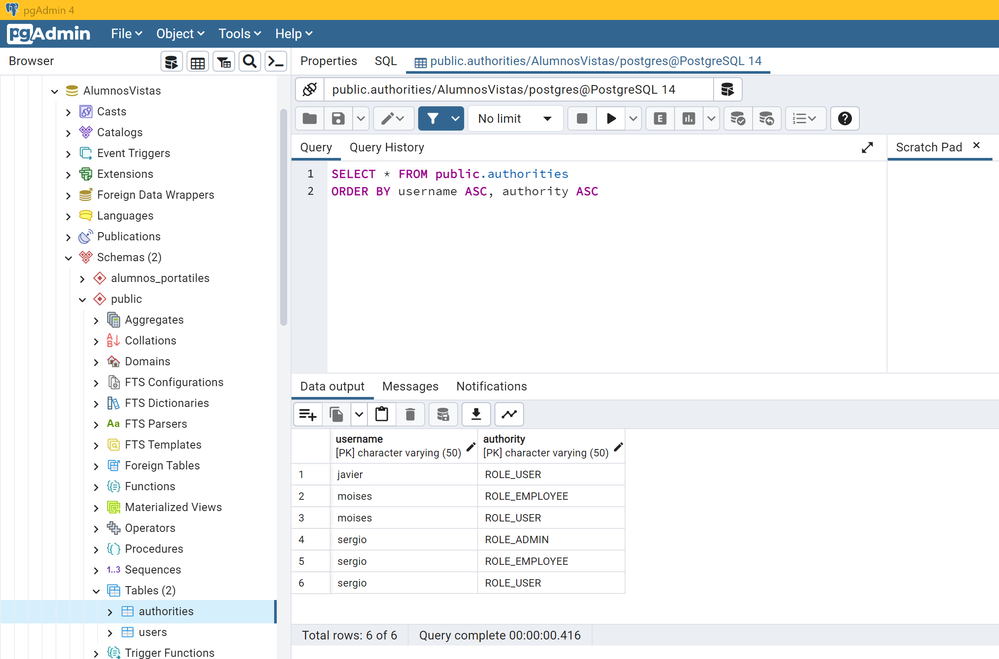

# Continuación del proyecto de AlumnosPortatiles --> Login y Register con Roles de usuario

- [Continuación del proyecto de AlumnosPortatiles --\> Login y Register con Roles de usuario](#continuación-del-proyecto-de-alumnosportatiles----login-y-register-con-roles-de-usuario)
- [0. Dependencias (pom.xml)](#0-dependencias-pomxml)
- [1. Login](#1-login)
	- [1.1. com.AlumnosPortatiles.project --\> SecurityInitializerConfig.java](#11-comalumnosportatilesproject----securityinitializerconfigjava)
	- [1.2. com.AlumnosPortatiles.project.app --\> AppSecurityConfig.java](#12-comalumnosportatilesprojectapp----appsecurityconfigjava)
- [Prueba de Ejecución 1 - Login Básico](#prueba-de-ejecución-1---login-básico)
- [2. Crear nuestro propio login](#2-crear-nuestro-propio-login)
	- [2.1. com.AlumnosPortatiles.project.app --\> AppSecurityConfig.java](#21-comalumnosportatilesprojectapp----appsecurityconfigjava)
	- [2.2. webapp --\> login.jsp](#22-webapp----loginjsp)
- [Prueba de Ejecución 2 - Login Propio Personalizado con Bootstrap](#prueba-de-ejecución-2---login-propio-personalizado-con-bootstrap)
- [3. Logout](#3-logout)
	- [3.1. com.AlumnosPortatiles.project.app --\> AppSecurityConfig.java](#31-comalumnosportatilesprojectapp----appsecurityconfigjava)
	- [3.2. webapp --\> index.jsp](#32-webapp----indexjsp)
	- [3.3. webapp --\> login.jsp](#33-webapp----loginjsp)
- [Prueba de Ejecución 3 - Logout](#prueba-de-ejecución-3---logout)
- [4. Obtener el rol del usuario](#4-obtener-el-rol-del-usuario)
	- [4.0. pom.xml](#40-pomxml)
	- [4.1. webapp --\> config --\> header.jsp](#41-webapp----config----headerjsp)
	- [4.2. webapp --\> index.jsp](#42-webapp----indexjsp)
- [Prueba de Ejecución 4 - Obtener el rol del usuario logeado y sacar su nombre y su rol por pantalla](#prueba-de-ejecución-4---obtener-el-rol-del-usuario-logeado-y-sacar-su-nombre-y-su-rol-por-pantalla)
- [5. Restringir zonas y restringir contenidos](#5-restringir-zonas-y-restringir-contenidos)
	- [5.1. com.AlumnosPortatiles.project.app --\> AppSecurityConfig.java](#51-comalumnosportatilesprojectapp----appsecurityconfigjava)
	- [5.2. webapp --\> index.jsp](#52-webapp----indexjsp)
	- [5.3. com.AlumnosPortatiles.project.web.controllers --\> IndexController.java](#53-comalumnosportatilesprojectwebcontrollers----indexcontrollerjava)
- [Prueba de Ejecución 5 - Restringir zonas y contenidos según roles](#prueba-de-ejecución-5---restringir-zonas-y-contenidos-según-roles)
- [6. Usuarios y roles en la BBDD](#6-usuarios-y-roles-en-la-bbdd)
	- [6.0. pom.xml](#60-pomxml)
	- [6.1. Crear las tablas e insertar los datos](#61-crear-las-tablas-e-insertar-los-datos)
	- [6.2. resoruces --\> application.properties](#62-resoruces----applicationproperties)
	- [6.3. com.AlumnosPortatiles.project.app --\> AppContextConfig.java](#63-comalumnosportatilesprojectapp----appcontextconfigjava)
	- [6.4. com.AlumnosPortatiles.project.app --\> AppSecurityConfig.java](#64-comalumnosportatilesprojectapp----appsecurityconfigjava)
- [Prueba de Ejecución 6 - Obtener los usuarios y roles de la bbdd](#prueba-de-ejecución-6---obtener-los-usuarios-y-roles-de-la-bbdd)
- [7. Registro básico](#7-registro-básico)
	- [7.1. com.AlumnosPortatiles.project.app --\> AppSecurityConfig.java](#71-comalumnosportatilesprojectapp----appsecurityconfigjava)
	- [7.2. com.AlumnosPortatiles.project.app.entities](#72-comalumnosportatilesprojectappentities)
		- [User.java](#userjava)
		- [Authority.java](#authorityjava)
	- [7.3. com.AlumnosPortatiles.project.app.repositories](#73-comalumnosportatilesprojectapprepositories)
		- [IUserRepository.java](#iuserrepositoryjava)
		- [IAuthorityRepository.java](#iauthorityrepositoryjava)
	- [7.4. com.AlumnosPortatiles.project.web.services](#74-comalumnosportatilesprojectwebservices)
		- [interfaces --\> IUserService.java](#interfaces----iuserservicejava)
		- [implementations --\> UserServiceImpl.java](#implementations----userserviceimpljava)
	- [7.5 com.AlumnosPortatiles.project.web.controllers](#75-comalumnosportatilesprojectwebcontrollers)
		- [IndexController.java](#indexcontrollerjava)
		- [RegisterController.java](#registercontrollerjava)
	- [7.6 webapp --\> register.jsp](#76-webapp----registerjsp)
- [Prueba de Ejecución 7 - Registro Básico](#prueba-de-ejecución-7---registro-básico)
- [8. Añadir validaciones en el registro](#8-añadir-validaciones-en-el-registro)
	- [8.0. pom.xml](#80-pomxml)
	- [8.1. com.AlumnosPortatiles.project.web.controllers --\> RegisterController.java](#81-comalumnosportatilesprojectwebcontrollers----registercontrollerjava)
	- [8.2. webapp --\> register.jsp](#82-webapp----registerjsp)
- [Prueba de Ejecución 8 - Registro con restricciones y comprobaciones](#prueba-de-ejecución-8---registro-con-restricciones-y-comprobaciones)
- [Webgrafía - Enlaces de Interés](#webgrafía---enlaces-de-interés)
	- [Píldoras Informáticas - Curso Spring](#píldoras-informáticas---curso-spring)
	- [Creación de usuarios](#creación-de-usuarios)
	- [Registration, Login, and Logout Example with Spring Boot](#registration-login-and-logout-example-with-spring-boot)
	- [Repositorio Ejemplo LuisMiguel OpenWebinars](#repositorio-ejemplo-luismiguel-openwebinars)


# 0. Dependencias (pom.xml)

```xml
<dependency>
	<groupId>org.springframework.security</groupId>
	<artifactId>spring-security-web</artifactId>
	<version>${org.springsecurity.version}</version>
</dependency>
	
<dependency>
	<groupId>org.springframework.security</groupId>
	<artifactId>spring-security-config</artifactId>
	<version>${org.springsecurity.version}</version>
</dependency>
```

# 1. Login



## 1.1. com.AlumnosPortatiles.project --> SecurityInitializerConfig.java

```java
public class SecurityInitializerConfig extends AbstractSecurityWebApplicationInitializer {

}
```

## 1.2. com.AlumnosPortatiles.project.app --> AppSecurityConfig.java

```java
@Configuration
@EnableWebSecurity
public class AppSecurityConfig extends WebSecurityConfigurerAdapter {

	@Override
	protected void configure(AuthenticationManagerBuilder auth) throws Exception {
	// aquí conectaremos con la bbdd donde estarán ya los usuarios registrados (userName, userPassword, userRole)
	// pero como aún (se supone) que no tenemos la bbdd con los usuarios... vamos a crear algunos usuarios a modo de prueba
		
	UserBuilder userTest = User.withDefaultPasswordEncoder(); // método obsoleto porque la contraseña se guarda en texto plano
	
    auth.inMemoryAuthentication()
		.withUser(userTest.username("sergio").password("123").roles("admin"))
		.withUser(userTest.username("moises").password("123").roles("employee"))
		.withUser(userTest.username("javier").password("123").roles("user"));
	}
}
```

# Prueba de Ejecución 1 - Login Básico

[Prueba de Ejecución 1](https://user-images.githubusercontent.com/91122596/224690508-65b71460-9f8e-4d33-a92d-457089de75c5.mp4)

# 2. Crear nuestro propio login

## 2.1. com.AlumnosPortatiles.project.app --> AppSecurityConfig.java

```java
@Configuration
@EnableWebSecurity
public class AppSecurityConfig extends WebSecurityConfigurerAdapter {
	
	...
	@Override
	protected void configure(HttpSecurity http) throws Exception {
		http
			.authorizeRequests()
				.anyRequest()
				.authenticated()
				.and()
			.formLogin()
				.loginPage("/login.jsp")
				.loginProcessingUrl("/loginUser")
				.permitAll()
		;
	}
}
```

Por ahora vamos a confugurar el HttpSecurity de forma básica para que nos funcione nuestro propio login.

Tan sólo debemos tener en cuenta que en el *.loginPage()* tenemos que escribir la ruta hacia el archivo de la vista de nuestro propio login.
Y que en el *.loginProcessingUrl()* lo que pongamos será lo que luego llevará el *action=""* del form de nuestro login.

## 2.2. webapp --> login.jsp

Dicho esto ya sólo queda crear el *login.jsp* en la raiz del webapps (al lado de nuestro index.jsp, o allá donde los hayas especificado en el *.loginPage()*).
Y en el form de esta vista, debemos tener en cuenta que el action es el *.loginProcessingUrl()* que hayamos especificado, que el method ha de ser *POST*, que los inputs de nombre y contraseña han de tener los *name=""* de *username* y *password*, respectivamente, y que el input del botón del login ha de ser de tipo submit.

En todo caso, el formulario de mi *login.jsp* me ha quedado así (bootstrap template):

```html
<form:form action="loginUser" method='POST'>
	<!-- Error message -->
	<c:if test="${param.error != null}">
		<div class="alert alert-danger">
			<p>Usuario o contraseña incorrectos.</p>
		</div>
	</c:if>
						
	<!-- Email input -->
	<div class="form-outline mb-4">
		<input type="text" name="username" class="form-control" />
		<label class="form-label">Usuario</label>
	</div>

	<!-- Password input -->
	<div class="form-outline mb-4">
		<input type="password" name="password" class="form-control" />
		<label class="form-label">Contraseña</label>
	</div>

	<!-- Submit button -->
	<div class="d-flex justify-content-center">
		<input type="submit" value="Login" class="btn btn-primary btn-block mb-4 " />
	</div>
</form:form>
```

# Prueba de Ejecución 2 - Login Propio Personalizado con Bootstrap

[Prueba de Ejecución 2](https://user-images.githubusercontent.com/91122596/224690761-9416225c-82d4-47e6-8740-5c5131329a7d.mp4)

# 3. Logout

## 3.1. com.AlumnosPortatiles.project.app --> AppSecurityConfig.java

```java
@Configuration
@EnableWebSecurity
public class AppSecurityConfig extends WebSecurityConfigurerAdapter {
	
	...
	@Override
	protected void configure(HttpSecurity http) throws Exception {
		http
			.authorizeRequests()
				.anyRequest()
				.authenticated()
				.and()
			.formLogin()
				.loginPage("/login.jsp")
				.loginProcessingUrl("/loginUser")
				.permitAll()
				.and()
			.logout()
				.permitAll()
		;
	}
}
```

## 3.2. webapp --> index.jsp

```html
...
<header class="mb-auto">
	<div>
		<h3 class="float-md-start mb-0">WebConfig</h3>
	    <nav class="nav nav-masthead justify-content-center float-md-end">
	    	<a class="nav-link fw-bold py-1 px-0 active" aria-current="page" href="#">Index</a>
	        <a class="nav-link fw-bold py-1 px-0" href="<c:url value="navigateToAlumnos" />">Alumnos</a>
	        <a class="nav-link fw-bold py-1 px-0" href="<c:url value="navigateToPortatiles" />">Portatiles</a>
	      	
	      	&nbsp;&nbsp;&nbsp;&nbsp;&nbsp;&nbsp;&nbsp;
	      	<a class="nav-link fw-bold py-1 px-0">
	      		<form:form action="logout" method='POST'>
	        		<input type="submit" value="Logout" />
	    		</form:form>
	      	</a>
	    </nav>
	</div>
</header>
...
```

## 3.3. webapp --> login.jsp

```html
<div class="card-body px-4 py-4 px-md-5">
	<form:form action="loginUser" method='POST'>
		<!-- Error message -->
		<c:if test="${param.error != null}">
			<div class="alert alert-danger">
				<p>Usuario o contraseña incorrectos.</p>
			</div>
		</c:if>
		<c:if test="${param.logout != null}">
			<div class="alert alert-success">
				<p>Has cerrado sesión. Hasta pronto!</p>
			</div>
		</c:if>
...
```

# Prueba de Ejecución 3 - Logout

[Prueba de Ejecución 3](https://user-images.githubusercontent.com/91122596/224690925-125a639d-50d4-4ada-8c4d-fbfc71baacbd.mp4)

# 4. Obtener el rol del usuario

## 4.0. pom.xml

```xml
...
<dependency>
    <groupId>org.springframework.security</groupId>
    <artifactId>spring-security-taglibs</artifactId>
    <version>${org.springsecurity.version}</version>
</dependency>
...
```

## 4.1. webapp --> config --> header.jsp

```html
...
<%@ taglib prefix="sec" uri="http://www.springframework.org/security/tags" %>
...
```

## 4.2. webapp --> index.jsp

```html
...
<main class="px-3">
	<h1>
		Bienvenido <sec:authentication property="principal.username" />
		<br/>
		<sec:authentication property="principal.authorities" />
	</h1>
	<br/><br/>
	<h3>Esto es el INDEX</h3>
	<p class="lead">
		Esto es un home hecho con una platilla de Bootstrap v5.2
	</p>
...
```

# Prueba de Ejecución 4 - Obtener el rol del usuario logeado y sacar su nombre y su rol por pantalla

[Prueba de Ejecución 4](https://user-images.githubusercontent.com/91122596/224691147-312a2c0a-58a8-4787-adbf-86aa3897509f.mp4)

# 5. Restringir zonas y restringir contenidos

## 5.1. com.AlumnosPortatiles.project.app --> AppSecurityConfig.java

```java
@Override
	protected void configure(HttpSecurity http) throws Exception {
	http
		.authorizeRequests()
//			.anyRequest()
//			.authenticated()
			.antMatchers("/").permitAll()
//			.antMatchers("/").hasRole("user")
			.antMatchers("/navigateToAlumnos").hasRole("employee")
			.antMatchers("/navigateToPortatiles").hasRole("employee")
			.antMatchers("/navigateToCreateFormAlumno").hasRole("admin")
			.antMatchers("/navigateToCreateFormPortatil").hasRole("admin")
			.and()
		.formLogin()
			.loginPage("/navigateToLogin")
			.loginProcessingUrl("/loginUser")
			.permitAll()
			.and()
		.logout()
			.permitAll()
			.and()
		.exceptionHandling()
			.accessDeniedPage("/accesoDenegado")
		;
	}
```

Con *.antMatchers("/navigateToAlumnos").hasRole("employee")* estamos diciendo que a la ventana de *alumnos.jsp* solo pueden acceder los empleados.

Con el *.exceptionHandling().accessDeniedPage("/accesoDenegado")* definimos cual será la vista a la que se llegará cuando el usuario trate de acceder a una zona restringida con su rol. Para esta vista, he tomado un ejemplo cualquiera de bootstrap.

## 5.2. webapp --> index.jsp

Para restringir contenidos dentro de una vista, he hecho la siguiente prueba en el index.jsp

```html
<main class="px-3">
	<h1>Esto es el INDEX</h1>
	<p class="lead">
		Esto es un home hecho con una platilla de Bootstrap v5.2
	</p>
	    
	<div class="d-flex justify-content-center">
		<sec:authorize access="hasRole('employee')">
			<p class="lead">
				<a href="<c:url value="navigateToAlumnos" />" class="btn btn-lg btn-secondary fw-bold border-white bg-white">Alumnos</a>
			</p>
			&nbsp;&nbsp;&nbsp;&nbsp;&nbsp;
			<p class="lead">
			  	<a href="<c:url value="navigateToPortatiles" />" class="btn btn-lg btn-secondary fw-bold border-white bg-white">Portatiles</a>
			</p>
	    </sec:authorize>
	</div>
</main>
```

## 5.3. com.AlumnosPortatiles.project.web.controllers --> IndexController.java

He añadido los siguientes métodos nuevos que cargan vistas:

```java
@RequestMapping(value = "/")
public String navigateToIndex() {
	return "index";
}	
	
@RequestMapping(value = "accesoDenegado")
public String navigateToAccesoDenegado() {
	return "accesoDenegado";
}
		
@RequestMapping(value = "/navigateToLogin")
public String navigateToLogin() {
	return "../login";
}
```

# Prueba de Ejecución 5 - Restringir zonas y contenidos según roles

[Prueba de Ejecución 5](https://user-images.githubusercontent.com/91122596/224691374-22b168d6-f116-41f9-8a5e-5598be1f289b.mp4)

# 6. Usuarios y roles en la BBDD

## 6.0. pom.xml

```xml
...
<dependency>
	<groupId>com.mchange</groupId>
	<artifactId>c3p0</artifactId>
	<version>0.9.5.5</version>
</dependency>
...
```

## 6.1. Crear las tablas e insertar los datos

Para hacer esto rápido vamos a importar en PostgreSQL un script, el cual crear las tablas de *users* y *authorities* en el esquema por defecto *public* y en la misma bbdd con la que veníamos trabajando en este proyecto.

> [AlumnosVistas.sql](./AlumnosVistas.sql)

Recuerda que para ejecutar un script sobre una bbdd que ya tengamos en postgre, podemos importar el archivo.sql con el siguiente comando (dentro de la carpeta *bin* del directorio donde se encuentre postgre en nuestro pc):

```bash
psql -h localhost -p 5432 -U postgres -f AlumnosVistas.sql AlumnosVistas
```





## 6.2. resoruces --> application.properties

Añadimos unos parámetros básicos para la configuración del *pool size*:

```xml
################# Pool Size #################
connection.pool.initialPoolSize=5
connection.pool.minPoolSize=5
connection.pool.maxPoolSize=20
connection.pool.maxIdleTime=3000
```

## 6.3. com.AlumnosPortatiles.project.app --> AppContextConfig.java

Añadimos el siguiente par de @Bean

```java
@Bean
public DataSource seguridadDataSource() {
	// creación del pool de conexiones
	ComboPooledDataSource seguridadDataSource = new ComboPooledDataSource();

	// establecer el driver JDBC
    try {
		seguridadDataSource.setDriverClass(enviroment.getProperty("spring.datasource.driverClassName"));
	} catch (PropertyVetoException e) {
		// TODO Auto-generated catch block
		e.printStackTrace();
	}
    	
    // hacer log de las propiedades de conexión
    logger.info("DB URL: " + enviroment.getProperty("spring.datasource.url"));
    logger.info("DB USER: " + enviroment.getProperty("spring.datasource.username"));
    	
    // establecer propiedades de conexión con la BBDD
    seguridadDataSource.setJdbcUrl(enviroment.getProperty("spring.datasource.url"));
    seguridadDataSource.setUser(enviroment.getProperty("spring.datasource.username"));
    seguridadDataSource.setPassword(enviroment.getProperty("spring.datasource.password"));
    	
    // establecer las propiedades del pool de conexión
    seguridadDataSource.setMinPoolSize(5);
    seguridadDataSource.setMaxPoolSize(20);
    seguridadDataSource.setInitialPoolSize(5);
    seguridadDataSource.setMaxIdleTime(3000);
    	
    return seguridadDataSource;
}
	
@Bean
public PasswordEncoder passwordEncoder() { 
    return NoOpPasswordEncoder.getInstance(); 
}
```

## 6.4. com.AlumnosPortatiles.project.app --> AppSecurityConfig.java

Añadimos un @Autowired para el *PasswordEncoder* y modificamos nuestro método *configure(AuthenticationManagerBuilder auth)* para obtener ahora los usuarios y sus roles de la bbdd.

```java
...
@Autowired
PasswordEncoder password;

@Override
protected void configure(AuthenticationManagerBuilder auth) throws Exception {
	// aquí conectaremos con la bbdd donde estarán ya los usuarios registrados (userName, userPassword, userRole)
	// pero como aún (se supone) que no tenemos la bbdd con los usuarios... vamos a crear algunos usuarios a modo de prueba
		
	// UserBuilder userTest = User.withDefaultPasswordEncoder(); // método obsoleto porque la contraseña se guarda en texto plano
	/*
	auth.inMemoryAuthentication()
		.withUser(userTest.username("sergio").password("123").roles("USER", "EMPLOYEE", "ADMIN"))
		.withUser(userTest.username("moises").password("123").roles("USER", "EMPLOYEE"))
		.withUser(userTest.username("javier").password("123").roles("USER"))
	;
	*/
		
	// ahora que ya tenemos la tabla de users y authorities en la bbdd podemos recoger los usuarios más automáticamente
	// auth.jdbcAuthentication().dataSource(seguridadDataSource)  // ERROR: There is no PasswordEncoder mapped for the id "null"
	auth.jdbcAuthentication().dataSource(seguridadDataSource).passwordEncoder(password);
}
```

# Prueba de Ejecución 6 - Obtener los usuarios y roles de la bbdd

[Prueba de Ejecución 6](https://user-images.githubusercontent.com/91122596/224691544-a37b8f84-fd70-4488-ad80-8f8d6dbe4cc8.mp4)

# 7. Registro básico

A continuación, vamos a implementar un *register* básico y simple, sin comprobaciones ni restricciones en el *username* ni en el *password*, y la contraseña pasará de guardarse en texto plano a guardarse encriptada.

## 7.1. com.AlumnosPortatiles.project.app --> AppSecurityConfig.java

Para que el *login* reconozca y se haga con las contraseñas encriptadas:

```java
@Configuration
@EnableWebSecurity
public class AppSecurityConfig extends WebSecurityConfigurerAdapter {
	...
	@Override
	protected void configure(AuthenticationManagerBuilder auth) throws Exception {
		auth.jdbcAuthentication().dataSource(seguridadDataSource).passwordEncoder(passwordEncoder());
	}
	
	@Bean
	public BCryptPasswordEncoder passwordEncoder() {
		return new BCryptPasswordEncoder();
	}
	...
}
```

## 7.2. com.AlumnosPortatiles.project.app.entities

### User.java

```java
@Entity
@Table(name = "users", schema = "public")
public class User implements Serializable {

	@Serial
	private static final long serialVersionUID = 1L;

	/******************************************* ATRIBUTOS *********************************************/
	@Id
	@Column(table = "users", name = "username", insertable = true, updatable = true, unique = true, nullable = false)
    private String username;

	@Column(table = "users", name = "password", insertable = true, updatable = true, unique = false, nullable = false)
    private String password;
    
	@Column(table = "users", name = "enabled", insertable = true, updatable = true, unique = false, nullable = false)
    private short enabled;
	/******************************************* RELACIONES *********************************************/
/*
	@OneToMany
	private List<Authority> authorities; // para tabla relacional intermedia
*/
	...
}
```

### Authority.java

```java
@Entity
@Table(name = "authorities", schema = "public")
public class Authority implements Serializable {

	@Serial
	private static final long serialVersionUID = 1L;

	/******************************************* ATRIBUTOS *********************************************/
	@Id
	@Column(table = "authorities", name = "id", insertable = false, updatable = false, unique = true, nullable = false)
	@GeneratedValue(strategy = GenerationType.IDENTITY)
    private long id;

	@Column(table = "authorities", name = "authority", insertable = true, updatable = true, unique = false, nullable = false)
    private String authority;
	
	/******************************************* RELACIONES *********************************************/
	@ManyToOne
    @JoinColumn(name = "username")
    private User user;
	...
}
```

## 7.3. com.AlumnosPortatiles.project.app.repositories

### IUserRepository.java

```java
@Repository(value = "IUserRepository")
public interface IUserRepository extends CrudRepository<User, String>{
	
	/**
	 * Find by username.
	 *
	 * @param username the username
	 * @return the user
	 */
	User findByUsername(String username);	
}
```

### IAuthorityRepository.java

```java
@Repository(value = "IAuthorityRepository")
public interface IAuthorityRepository extends CrudRepository<Authority, Long> {

}
```

## 7.4. com.AlumnosPortatiles.project.web.services

### interfaces --> IUserService.java

```java
public interface IUserService {
	
	/**
	 * Insertar usuario.
	 *
	 * @param user the user
	 */
	void insertarUsuario(User user);
}
```

### implementations --> UserServiceImpl.java

```java
@Service(value = "UserServiceImpl")
public class UserServiceImpl implements IUserService {

	@Autowired
    private IUserRepository userRepository;
	
	@Autowired
    private IAuthorityRepository authorityRepository;
	
	@Autowired
    private PasswordEncoder passwordEncoder = new BCryptPasswordEncoder();
	
	@Override
	public void insertarUsuario(User user) {
		user.setPassword(passwordEncoder.encode(user.getPassword()));
		user.setEnabled((short)1);
        userRepository.save(user);
        
        authorityRepository.save(new Authority("ROLE_USER", user));
        authorityRepository.save(new Authority("ROLE_EMPLOYEE", user)); // para testear mejor (el ROLE_USER tan solo se queda en el index)
	}	
}
```

## 7.5 com.AlumnosPortatiles.project.web.controllers

### IndexController.java

```java
@RequestMapping(value = "/navigateToRegister")
public String navigateToRegister(Model model) {
	model.addAttribute("userModel", new User());
	return "../register";
}
```

### RegisterController.java

```java
@Controller(value = "RegisterController")
public class RegisterController {

	@Autowired
	private IUserService userService = new UserServiceImpl();
	
	@RequestMapping(value = "/register", method = RequestMethod.POST)
	public String register(@ModelAttribute("userModel") User userModel) {
	// Nota: de momento, no gestionamos posibles errores en los datos recibidos.
	userService.insertarUsuario(userModel);
	    
	return "redirect:/navigateToLogin";
	}
}
```

## 7.6 webapp --> register.jsp

```html
<form:form action="register" modelAttribute="userModel" method='POST'>
	<!-- Username input -->
	<div class="form-outline mb-4">
		<input type="text" name="username" class="form-control" />
		<label class="form-label">Usuario</label>
	</div>
	<!-- Password input -->
	<div class="form-outline mb-4">
		<input type="password" name="password" class="form-control" />
		<label class="form-label">Contraseña</label>
	</div>
	<!-- Submit button -->
	<div class="d-flex justify-content-center">
		<input type="submit" value="Register" class="btn btn-primary btn-block mb-4 " />
	</div>
</form:form>
```

# Prueba de Ejecución 7 - Registro Básico

[Prueba de Ejecución 7](https://user-images.githubusercontent.com/91122596/224691717-fcd3d4de-271a-497c-a0ab-cd535fdeb6fa.mp4)

# 8. Añadir validaciones en el registro

## 8.0. pom.xml

```xml
...
<dependency>
	<groupId>javax.validation</groupId>
	<artifactId>validation-api</artifactId>
	<version>2.0.1.Final</version>
</dependency>
...
```

## 8.1. com.AlumnosPortatiles.project.web.controllers --> RegisterController.java

```java
@Controller(value = "RegisterController")
public class RegisterController {

	@Autowired
	private IUserRepository userRepository;
	
	@Autowired
	private IUserService userService = new UserServiceImpl();
	
	@RequestMapping(value = "/register", method = RequestMethod.POST)
	public String register(@Valid @ModelAttribute("userModel") User userModel, BindingResult bindingResult, @RequestParam String confirmPassword) {
		if (bindingResult.hasErrors())
	        return "/navigateToRegister";
	    
		if (userRepository.findByUsername(userModel.getUsername()) != null)
	        return "redirect:/navigateToRegister?username_already_exists";
	    
		if (userModel.getPassword().equals(confirmPassword)) 
	        userService.insertarUsuario(userModel);
		else
	        return "redirect:/navigateToRegister?passwords_not_match";
	    
	    return "redirect:/navigateToLogin?registered";
	}
}
```

## 8.2. webapp --> register.jsp

```html
<form:form action="register" modelAttribute="userModel" method='POST'>
	<!-- Error message -->
	<c:if test="${param.username_already_exists != null}">
		<div class="alert alert-danger">
			<p>El nombre de usuario introducido ya existe.</p>
		</div>
	</c:if>
	<c:if test="${param.passwords_not_match != null}">
		<div class="alert alert-danger">
			<p>Las contraseñas no coinciden.</p>
		</div>
	</c:if>
							
	<!-- Email input -->
	<div class="form-outline mb-4">
		<input type="text" name="username" class="form-control" required />
		<label class="form-label">Usuario</label>
	</div>

	<!-- Password input -->
	<div class="form-outline mb-4">
		<input type="password" name="password" class="form-control" required />
		<label class="form-label">Contraseña</label>
	</div>
							
	<!-- Confirm Password input -->
	<div class="form-outline mb-4">
		<input type="password" name="confirmPassword" class="form-control" required />
		<label class="form-label">Repetir Contraseña</label>
	</div>

	<!-- Submit button -->
	<div class="d-flex justify-content-center">
		<input type="submit" value="Register" class="btn btn-primary btn-block mb-4 " />
	</div>
</form:form>
```

# Prueba de Ejecución 8 - Registro con restricciones y comprobaciones

[Prueba de Ejecución 8](https://user-images.githubusercontent.com/91122596/224691895-1b8400b4-8d28-4a59-a154-f0f3e5dd4fb5.mp4)

# Webgrafía - Enlaces de Interés

## Píldoras Informáticas - Curso Spring

Desde el vídeo 95 hasta el video 107

https://www.youtube.com/@pildorasinformaticas/videos

## Creación de usuarios

http://www.it.uc3m.es/jaf/aw/practicas/4-spring/

## Registration, Login, and Logout Example with Spring Boot

https://hellokoding.com/registration-and-login-example-with-spring-security-spring-boot-spring-data-jpa-hsql-jsp/

## Repositorio Ejemplo LuisMiguel OpenWebinars

https://github.com/OpenWebinarsNet/curso_spring_boot_mvc/tree/master/SecondHandMarket_final